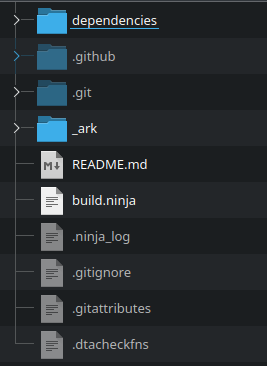

## *Dance Central 3 Deluxe* is a Quality-of-Life Improvement Mod by [MiloHax](https://github.com/hmxmilohax)

### This mod is currently very early in development, so there isn't much here right now.

### 👉 See [Current Feature List](#-current-feature-list)

### 📥 [Download Now!](#%EF%B8%8F-what-youll-need)

 

 

# 👉 Current Feature List

* No Motion Blur in menus
* All venues from DC2

 

# ✍️ What You'll Need

### Playing *Dance Central 3 Deluxe* requires these things:

- **A vanilla copy of Dance Central 3** for Xbox 360 that you can extract onto your PC.
- A **modded/hacked Xbox 360** and a way to transfer files to it. We recommend using FTP.

 

# 📥 Download

*Dance Central 3 Deluxe recieves very frequent updates. You can click the `Watch` button (All Activity) to be notified about any updates that occur.*

### 📥 [Dance Central 3 Deluxe](https://nightly.link/hmxmilohax/dance-central-3-deluxe/workflows/build/main/DC3DX-Xbox.zip)

> The most recent Nightly build of *Dance Central 3 Deluxe*.

 

# 📩 How to Install

**NOTE: You WILL need a HACKED/MODDED (RGH or JTAG) Xbox 360 in order to play this mod. We hope this is clear.**

* **Install your vanilla copy of Dance Central 3** to your console's hard drive.
  * In case anything goes wrong, we recommend that you **rename `default.xex` to `default_vanilla.xex`**.

* **Disable updates** for Dance Central 3 in Aurora. *Dance Central 3 Deluxe* rolls `TU1` into its base installation.

* Download [**Dance Central 3 Deluxe**](https://nightly.link/hmxmilohax/dance-central-3-deluxe/workflows/build/main/DC3DX-Xbox.zip). 
  * **Copy the contents of it to where your copy of Dance Central 3 is installed** (we recommend using FTP to do so).
  * Select `Yes` to overwrite the files if it asks you to.

### ✅ ***Dance Central 3 Deluxe is now installed!***

 

***Sidenote:*** We also recommend **clearing your system cache** if this is your first time installing the mod.
* Navigate to `System Settings > Storage` and press `Y` to clear the system cache.*

 

# 🔨 Building (Advanced)

### Installing Python (Required)

* Head to the [**Python downloads**](https://www.python.org/downloads/), download and install Python (version 3.9 or later).
  * ***Select "Add python.exe to PATH"*** on the installer.

### Initializing the Repo

* Go to the **[Releases](https://github.com/hmxmilohax/dance-central-3-deluxe/releases)** of this repo and **download `_init_repo.py`**.
  * Make a new **empty** folder, **put `_init_repo.py` in the folder, and run it**. This will pull the repo down for you and make sure you're completely up to date. **This will take some time.**

### ***The folder should look like this once it's done:***

### ✅ ***The Dance Central 3 Deluxe repo is now set up!***

From here, you can make any personal modifications to the game or build it yourself.

* Navigate to `windows_bats` if you're on Windows or `user_scripts` if you're on Linux.
  * Run the `build_` script for your platform of choice to build *Dance Central 3 Deluxe*.
  * Built contents will be in the `_build` folder on the root of the repo.

 

# 🖥️ Dependencies

[Git for Windows](https://gitforwindows.org/) - CLI application to allow auto updating Deluxe repo files

[Dot Net 6.0 Runtime](https://dotnet.microsoft.com/en-us/download/dotnet/6.0/runtime) - Needed to run ArkHelper

[Python](https://www.python.org/downloads/) - For user script functionality (NOTE: 3.9 or newer is highly recommended!)

[Mackiloha](https://github.com/PikminGuts92/Mackiloha) - ArkHelper for building Deluxe

[dtab](https://github.com/mtolly/dtab) - For serializing `.dtb` script files
